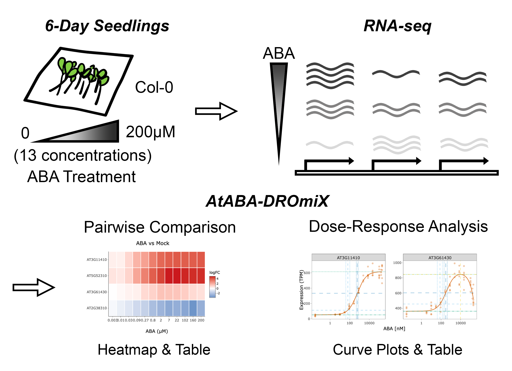

# AtABA-DROmiX

**AtABA-DROmiX** stands for <u>**A**</u>rabidopsis-<u>**t**</u>haliana-<u>**ABA**</u>-<u>**D**</u>ose-<u>**R**</u>esponse-Transcript<u>**omi**</u>cs-E<u>**x**</u>plorer. A shiny app that can explore the dose-response behavior of the genes on transcriptional level in *Arabidopsis* seedlings.   

## Description
  

Welcome to the AtABA-DROmiX, a user-friendly application designed to help you dive into our exciting RNA-seq dataset! In our study, as illustrated in the diagram, 6-day-old *Arabidopsis thaliana* (Col-0) seedlings were treated with 13 concentrations of ABA, ranging from 3nM to 200 uM for 10 hours. RNA-seq was then performed to capture the dose-dependent changes in gene expression over ABA treatments. Beyond standard analyses such as fold change under ABA treatments, our study identified 3408 ABA-responsive genes exhibiting clear dose-response trends. For these genes, dose-response curves were generated, and the key metrics, ED<sub>50</sub> and BMD<sub>1SD</sub> values, were estimated using the Serra-Greco method, as detailed in our earlier [BioCurve Analyzer publication](https://github.com/ZenanXing/BioCurve-Analyzer.git).  

Here, we introduced this explorer, AtABA-DROmiX, which can help researchers explore the complex dose-response behaviors of genes that they are interested in by simply provide the AGI locus code (e.g. AT5G52310). You can download the results including the heatmap, fold-change data, ED-related values (ED<sub>50</sub> and BMD<sub>1SD</sub>), and the customized dose-response curves. For genes not showing clear trends in our research, simple line plots will be provided.  

So, start exploring the ABA dose-response world! Let the AtABA-DROmiX help you making exciting scientific discoveries!  

Happy exploring :)

## Getting Started

AtABA-DROmiX can be used both locally and online. The app can be installed following the instructions below and it is also hosted on Shinyapps.io: .  

### Installation

To use AtABA-DROmiX locally, you can follow the steps.  

  1. Install R and RStudio IDE. The app has been tested with R 4.4.1 and RStudio version 2024.04.2+764.  

  2. Clone or download the BioCurve Analyzer from the GitHub. You can either [clone the repository](https://docs.github.com/en/repositories/creating-and-managing-repositories/cloning-a-repository) using git or download the app as a ZIP file.  
  In addition, these R packages should also be installed by from CRAN using the code below.  

      ```
      install.packages("shiny", "shinythemes", "shinycssloaders", "shinyjs", "bslib", "openxlsx", "tidyverse", "heatmaply", "plotly", "htmlwidgets", "DT", "ggpp", "ggpubr")
      
      ```

  3. Run the shiny app using the following code in RStudio.

      ```
      shiny.runApp()
      ```
      
[(Back to top)](#ataba-dromix)

### Help

If you need any help or support related to this app, feel free to contact us at zxing001@ucr.edu, and the issues can also be reported on https://github.com/ZenanXing/AtABA-DROmiX/issues.  

[(Back to top)](#ataba-dromix)

## License & DOI

This project is licensed under the GNU General Public License, version 3 (GPLv3) - see the LICENSE.md file for details, and the DOI for the app is .  
  
[(Back to top)](#ataba-dromix)

## Citations

If you use the AtABA-DROmiX, please cite our paper and the related papers listed below.

*Xing Z, Park SY, Eckhardt J, Cutler SR. ABA signaling secrets: Decoding gene sensitivity and exploring receptor subfamily function in gene regulation. (manuscript in preparation)*  
  
[(Back to top)](#ataba-dromix)

## References

*Ritz C, Baty F, Streibig JC, Gerhard D. [Dose-Response Analysis Using R](https://journals.plos.org/plosone/article?id=10.1371/journal.pone.0146021). PLoS One. 2015;10:e0146021.*  
*Serra A, Saarimäki LA, Fratello M, Marwah VS, Greco D. [BMDx: a graphical Shiny application to perform Benchmark Dose analysis for transcriptomics data](https://academic.oup.com/bioinformatics/article/36/9/2932/5709037). Bioinformatics. 2020;36:2932–3.*  
*Xing Z, Eckhardt J, Vaidya AS, Cutler SR. [BioCurve Analyzer: a web-based shiny app for analyzing biological response curves](https://rdcu.be/ejBEp). Plant Methods 2025; 21: 1–9* 

[(Back to top)](#ataba-dromix)
