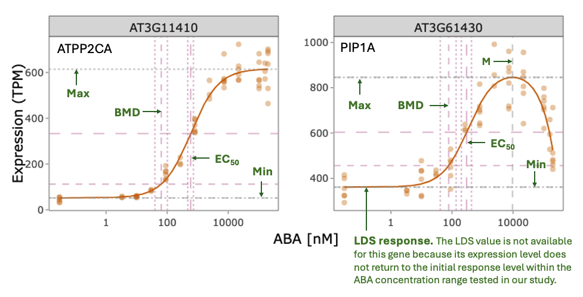
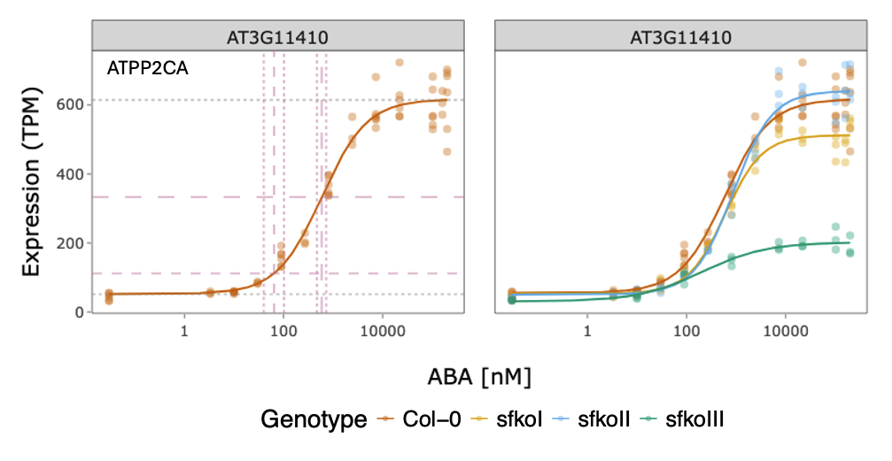

### **Export the Dose-Response Curves**

In this panel, you can visualize and export the **dose-response curves** of the input ABA-responsive genes together with their corresponding **ED (effective dose)-related values**.

You can preview **one gene** at a time when mutant dose-response curves are included, or **up to two genes** at a time when displaying wild-type data only. Once you are satisfied with the preview in this section, you can download the dose-response curves for **all selected genes** as a PDF from the **Download** section.

#### **ED-Related Values**

For all ABA-responsive genes, the **maximum and minimum response values**, **EC50**, and **BMD** are provided. For genes exhibiting a **bell-shaped response**, two additional parameters, **LDS** and **M**, are also reported.

The definitions of these parameters are explained below, and their positions on monotonic and bell-shaped dose-response curves are illustrated in Figure 3.

- **EC50 (half-maximal effective concentration):** the ABA concentration required to reach 50% of the maximal response. For bell-shaped curves, EC50 refers to the concentration corresponding to the half-maximal response during the initial phase of the curve.
- **BMD (benchmark dose):** the ABA concentration required to produce a predefined change in gene expression. In this study, BMD was estimated using a **10% change in expression** as the benchmark response.
- **LDS (limiting dose for stimulation):** the ABA concentration at which the response returns to the untreated control level during the second phase of a bell-shaped curve.
- **M (dose of maximum stimulation):** the ABA concentration that elicits the maximum stimulatory response.

<strong>Figure 3. Dose-response curves of ABA-responsive genes in the wild type.</strong>

 

Illustration of representative monotonic and bell-shaped dose-response curves and their corresponding ED-related parameters.

#### **Mutant Dose-Response Curves**

You can choose whether to include **mutant dose-response curves** in the visualization and exported PDF, as illustrated in Figure 4.

When mutant curves are included, the transcriptional dose-response data from the selected mutants are fitted using the **same dose-response model selected for the corresponding wild-type gene**. The mutant curves are displayed alongside the wild-type curve to facilitate visual comparison of transcriptional responses across genotypes.

The mutant dose-response curves are provided **for reference and exploratory comparison only**. Statistical tests used to evaluate the wild-type dose-response curves were not applied to the mutant curves.

<strong>Figure 4. Comparison of wild-type and mutant dose-response curves.</strong>

 

Illustration of dose-response curves displayed for the wild type together with the selected ABA receptor mutants.

