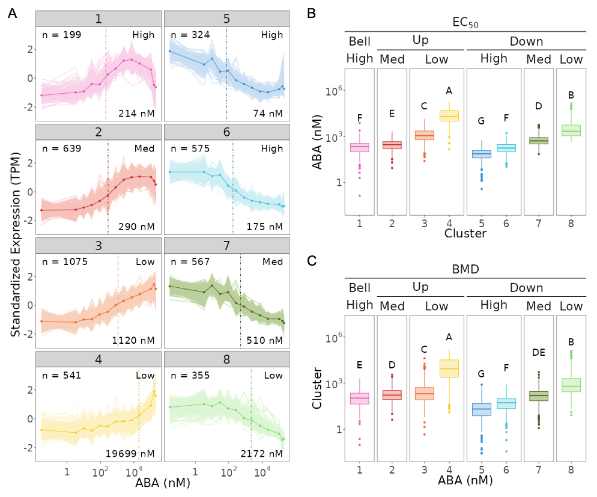

### **Gene List**

In this panel, you can provide a list of genes you are interested in exploring. You can enter **AGI locus identifiers** directly or upload a gene list in **TSV, CSV, or Excel** format.

Alternatively, one of the key features of our app is the ability to explore predefined groups of ABA-responsive genes. In our study, ABA-responsive genes were classified into **eight clusters** based on their dose-dependent expression patterns and sensitivity to ABA using *fuzzy c-means clustering* (Futschik and Carlisle, 2005).

In our app, you can explore ABA-responsive genes using two classification options:

- **By Cluster:** Explore genes according to the eight clusters identified from their dose-response expression patterns.
- **By Response Features:** Explore genes according to either their **response pattern** or **ABA sensitivity**.
    - **Pattern:** Bell, Up, or Down
    - **Sensitivity:** High, Medium, or Low

#### **By Cluster**

Select **By Cluster** to explore ABA-responsive genes according to the eight clusters identified from their dose-response expression patterns.

As shown in Figure 2A, the eight clusters represent three major types of dose-response behavior:

- **Bell-shaped response:** Cluster 1
- **Monotonic up-regulation:** Clusters 2–4
- **Monotonic down-regulation:** Clusters 5–8

Genes within each cluster share similar transcriptional responses across the ABA concentration range. The clusters also differ in their sensitivity to ABA.

#### **By Response Features**

Select **By Response Features** to explore ABA-responsive genes based on broader characteristics of their dose-response behavior. Genes can be grouped by either **Pattern** or **Sensitivity**.

To characterize ABA sensitivity, dose-response curves were fitted to individual genes. Two key sensitivity metrics were estimated:

- **EC50 (half-maximal effective concentration):** the ABA concentration required to reach 50% of the maximal response.
- **BMD (benchmark dose):** the ABA concentration required to produce a predefined change in gene expression. In this study, BMD was estimated using a **10% change in expression** as the benchmark response.

These metrics allowed us to characterize and compare ABA sensitivity among the identified clusters. The median EC50 for each cluster is indicated by the vertical dotted lines in Figure 2A. The distributions of EC50 and BMD values among clusters are shown in Figure 2B and Figure 2C, respectively.

##### **- Pattern**

Genes are grouped according to the overall shape and direction of their transcriptional response to increasing ABA concentrations:

- **Bell:** Genes exhibiting a bell-shaped response.
- **Up:** Genes showing monotonic up-regulation.
- **Down:** Genes showing monotonic down-regulation.

##### **- Sensitivity**

Genes are grouped according to their relative sensitivity to ABA:

- **High:** Genes responding at relatively low ABA concentrations.
- **Medium (Med):** Genes showing intermediate sensitivity to ABA.
- **Low:** Genes requiring relatively high ABA concentrations to respond.

<strong>Figure 2. ABA-responsive genes exhibit distinct dose-response patterns and sensitivities.</strong>

 

<strong>(A)</strong> Expression profiles of ABA-responsive genes based on their dose-response patterns. In each panel, the number in the upper-left corner indicates the total number of ABA-responsive genes within that cluster, while the value in the lower-right corner represents the median EC50 of the cluster. The vertical dotted line indicates the median EC50.
 
<strong>(B–C)</strong> ABA-responsive gene clusters and their corresponding EC50 (B) and BMD (C) values. Based on their dose-response patterns, genes were categorized as Bell, Up, or Down responders. Based on their sensitivity to ABA, genes were further categorized into High, Medium (Med), and Low sensitivity groups. Uppercase letters indicate significant differences among clusters based on the Games–Howell test (<i>p</i> &lt; 0.01).

#### **References**

*Futschik, M.E. and Carlisle, B. (2005). Noise-robust soft clustering of gene expression time-course data. Journal of Bioinformatics and Computational Biology, 3(4), 965–988.*

