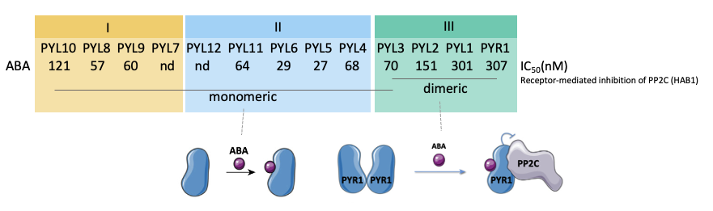

### **Genotype**

In this panel, you can select the **ABA receptor mutants** you would like to explore.

Abscisic acid (ABA) is a key phytohormone that regulates diverse aspects of plant growth, development, and stress responses. ABA signaling is initiated through perception by the **PYR/PYL/RCAR family of ABA receptors**. In *Arabidopsis thaliana*, this family consists of 14 members that can be classified into three subfamilies, **I, II, and III**, based on their oligomeric states and ABA-binding properties, as illustrated in the figure below. To investigate the biological roles of these receptor subfamilies, we generated three higher-order mutants, ***sfkoI***, ***sfkoII***, and ***sfkoIII***, each carrying mutations in ABA receptors belonging to a different subfamily.

You can explore the transcriptional dose-response behavior of ABA-responsive genes in these three receptor mutants with the **wild type (Col-0)**. Select the mutant(s) you are interested in to compare how disruption of different ABA receptor subfamilies affects transcriptional responses across ABA concentrations.

<strong>Figure 1. ABA receptor subfamilies and their relative ABA sensitivities in <i>Arabidopsis</i>.</strong>

 

The values shown below each receptor represent the IC50 values measured in receptor-mediated inhibition of PP2C assays. The figure was adapted from Okamoto et al. (2013) and Rodriguez and Lozano-Juste (2015).

#### **References**

*Okamoto M, Peterson FC, Defries A, Park S-Y, Endo A, Nambara E, Volkman BF, Cutler SR (2013) Activation of dimeric ABA receptors elicits guard cell closure, ABA-regulated gene expression, and drought tolerance. Proc Natl Acad Sci U S A 110: 12132–12137.*
*Rodriguez PL, Lozano-Juste J (2015) Unnatural agrochemical ligands for engineered abscisic acid receptors. Trends Plant Sci 20: 330–332.*